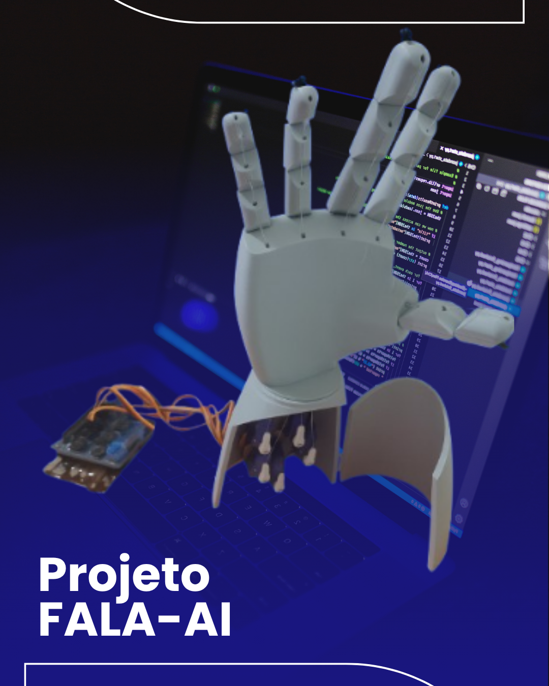

<p align="center">
  
</p>

<h1 align="center">🧠 <strong>FALA-AI</strong></h1>
<h3 align="center"><em>Tradutor de Voz para Libras com Mão Robótica 3D</em></h3>

<p align="center">
  <strong>🚀 Versão v1.0 - Protótipo Funcional</strong><br>
  <em>Promovendo acessibilidade através da tecnologia</em>
</p>

<p align="center">
  
  
  
  
  
</p>

---

## 📘 **Visão Geral**

> **O Fala-AI** é um sistema inovador que desenvolve um tradutor de voz para **Libras** (Língua Brasileira de Sinais) utilizando uma mão robótica impressa em 3D controlada por Arduino, integrada com APIs de reconhecimento de fala através da biblioteca SpeechRecognition em Python.
> 
> **🎯 Missão:** Promover acessibilidade comunicacional entre pessoas ouvintes e surdas, traduzindo fala em movimentos manuais correspondentes às letras do alfabeto da Libras.

### 🎯 **Status do Projeto**

| ✅ **Implementado** | 🔄 **Em Desenvolvimento** |
|:-------------------|:--------------------------|
| 🎤 **Reconhecimento de voz**: Google Speech API | ⚙️ **Calibração**: Ajustes finos |
| 🤖 **Controle robótico**: 5 servomotores SG90 | 🎨 **Interface gráfica**: Planejada para v2.0 |
| 🔤 **Alfabeto completo**: A-Z mapeado | 🌐 **Conectividade**: WiFi/Bluetooth |
| 📡 **Comunicação serial**: Python ↔ Arduino | 🧠 **IA Local**: Integração Whisper |
| 💻 **Interface CLI**: Sistema interativo | |
| 📊 **Sistema de logs**: Monitoramento completo | |

---

## 🚀 **Como Usar**

### **⚡ Quick Start**

#### **1️⃣ Instalação**
```bash
# 📦 Instalar dependências
pip install -r requirements.txt
```

#### **2️⃣ Hardware Setup**
```bash
# 🔌 Conectar Arduino via USB
# 📤 Carregar: app/src/arduino/servo_control/servo_control.ino
```

#### **3️⃣ Pinagem dos Servos**

| **Pino Arduino** | **Servo** | **Dedo** |
|:----------------:|:---------:|:--------:|
| `3` | Servo 1 | 👍 **Polegar** |
| `5` | Servo 2 | ☝️ **Indicador** |
| `6` | Servo 3 | 🖕 **Médio** |
| `9` | Servo 4 | 👈 **Anelar** |
| `10` | Servo 5 | 🤙 **Mindinho** |

#### **4️⃣ Execução**
```bash
cd app/src/python
python main.py
```

#### **5️⃣ Comandos Disponíveis**

| **Comando** | **Ação** |
|:-----------:|:--------:|
| `ENTER` | 🎤 **Falar e traduzir** |
| `test` | 🔧 **Testar Arduino** |
| `q` | ❌ **Sair** |

---

## 🏗️ **Arquitetura Técnica**

### **🔄 Pipeline de Processamento**

```
🎤 Microfone → 🐍 Python → 🧠 Speech API → ⚙️ Processamento → 📡 Arduino → 🤖 Servos → ✋ Mão Robótica
     │              │            │               │              │           │            │
    Voz        Captura de    Reconhecimento   Limpeza de     Controle    Movimento    Sinais
               Áudio         de Fala          Texto          PWM         Coordenado   Libras
```

### **🔧 Componentes Principais**

| **Componente** | **Tecnologia** | **Função** |
|:--------------:|:--------------:|:----------:|
| **🖥️ Frontend** | Python CLI | Interface do usuário |
| **🎤 Speech Engine** | Google Speech API | Reconhecimento de voz |
| **⚙️ Controller** | Arduino Uno R3 | Controle de hardware |
| **🤖 Actuators** | 5x Servos SG90 | Movimentação dos dedos |
| **🏗️ Structure** | Mão 3D PLA | Estrutura mecânica |

### **📊 Especificações Técnicas**

| **⚡ Performance** | **🔋 Energia** | **🌐 Compatibilidade** |
|:------------------:|:--------------:|:----------------------:|
| Latência: `~2-3s` | Alimentação: `5V/2A` | Windows `10/11` |
| Precisão: `85-95%` | Consumo: `~500mA` | Linux `Ubuntu 20.04+` |
| Comunicação: `9600 baud` | Eficiência: `Alta` | macOS `10.15+` |

---

## 🤖 **Hardware**

### **💰 Lista de Componentes**

| **Item** | **Qtd** |
|:--------:|:-------:|
| 🔧 **Arduino Uno R3** | `1x` |
| ⚙️ **Servo SG90** | `5x` | 
| 🔌 **Fonte 5V/2A** | `1x` |
| 🖐️ **Mão Robótica 3D** | `1x` | 
| 🔗 **Protoboard + Jumpers** | `1x` |


### **🔌 Esquema de Ligação**

```
🔧 Arduino    ⚙️ Servo     🖐️ Dedo
    3      →    SG90    →   👍 Polegar
    5      →    SG90    →   ☝️ Indicador  
    6      →    SG90    →   🖕 Médio
    9      →    SG90    →   👈 Anelar
   10      →    SG90    →   🤙 Mindinho

🔋 Alimentação:
5V Fonte → VCC Servos
GND      → GND Comum (Arduino + Servos)
```

---

## 💻 **Software Stack**

### **📦 Dependências Python**

```bash
speechrecognition>=3.10.0  # 🎤 Reconhecimento de voz
pyaudio>=0.2.11           # 🔊 Captura de áudio
pyserial>=3.5             # 📡 Comunicação serial
numpy>=1.21.0             # 🔢 Processamento numérico
```

### **📁 Estrutura do Código**

```
📁 fala-ai/
├── 📁 app/src/
│   ├── 🐍 python/
│   │   ├── 🚀 main.py              # Ponto de entrada
│   │   ├── ⚙️ config_manager.py    # Configurações
│   │   ├── 📦 modules/
│   │   │   ├── 🎤 speech_recognition_module.py
│   │   │   └── 📡 serial_communication.py
│   │   └── 🛠️ utils/
│   │       ├── 📊 logger.py
│   │       └── 📝 text_utils.py
│   └── 🤖 arduino/
│       └── ⚙️ servo_control/
│           ├── 🔧 servo_control.ino
│           └── 📋 servo_positions.h
├── 📚 docs/
└── 🖼️ IMG/
```

---

## 📋 **Funcionalidades v1.0**

### **🎯 Core Features**

| **🎤 Reconhecimento** | **🤖 Hardware** | **💻 Software** |
|:---------------------:|:---------------:|:---------------:|
| ✅ Voz em tempo real | ✅ 5 servomotores SG90 | ✅ Arquitetura modular |
| ✅ Google Speech API | ✅ Detecção automática | ✅ Configuração flexível |
| ✅ Português brasileiro | ✅ Movimentos suaves | ✅ Logs detalhados |
| ✅ Filtro de ruído | ✅ Reset automático | ✅ Tratamento de erros |

---

## 🎯 **Mapeamento dos Dedos**

> **⚠️ Importante:** Respeite a ordem dos pinos para funcionamento correto!

| **🤖 Servo** | **👋 Dedo** | **🔌 Pino** | **⚙️ Função** |
|:------------:|:-----------:|:------------:|:-------------:|
| `1` | 👍 **Polegar** | `3` | Oposição e apoio |
| `2` | ☝️ **Indicador** | `5` | Apontamento principal |
| `3` | 🖕 **Médio** | `6` | Suporte central |
| `4` | 👈 **Anelar** | `9` | Complemento |
| `5` | 🤙 **Mindinho** | `10` | Detalhes finos |

---

## 🎯 **Roadmap v2.0**

### **🚀 Melhorias Planejadas**

| **🎨 Interface & UX** | **🧠 IA & Performance** |
|:---------------------:|:-----------------------:|
| ☐ Interface Gráfica (PyQt/Tkinter) | ☐ Palavras Completas |
| ☐ Mobile App | ☐ Machine Learning Local |
| ☐ Feedback Háptico | ☐ Gestos Dinâmicos |
| ☐ Multi-idioma | ☐ Conectividade WiFi/Bluetooth |

### **⚡ Otimizações Técnicas**

| **Métrica** | **v1.0 Atual** | **🎯 Meta v2.0** |
|:-----------:|:---------------:|:-----------------:|
| **⚡ Latência** | `2.5s` | `<1.0s` |
| **🎯 Precisão** | `90%` | `>95%` |
| **❌ Taxa de erro** | `10%` | `<5%` |
| **⏱️ Tempo/letra** | `1.0s` | `0.5s` |
| **🔋 Consumo** | `500mA` | `300mA` |

---

## 📊 **Métricas de Performance**

### **🏆 Benchmarks Atuais**

| **⚡ Velocidade** | **🎯 Qualidade** | **🌐 Compatibilidade** |
|:-----------------:|:----------------:|:----------------------:|
| Pipeline: `2.5s` | Precisão voz: `90%` | ✅ Windows 10/11 |
| Reconhecimento: `1.2s` | Taxa sucesso: `85%` | ✅ Ubuntu 20.04+ |
| Movimento: `1.0s` | Estabilidade: `95%` | 🔄 macOS (testes) |

---

## 🐛 **Issues Conhecidos**

### **⚠️ Limitações Atuais**

1. **🔊 Ruído ambiente**: Afeta precisão do reconhecimento
2. **⚙️ Calibração manual**: Servos precisam ajuste individual  
3. **🌐 Dependência internet**: Google Speech API requer conexão
4. **🔤 Apenas alfabeto**: Não suporta palavras completas ainda

### **🔧 Soluções em Desenvolvimento**

- **🎛️ Filtro de ruído**: Implementação de noise gate
- **🤖 Auto-calibração**: Sistema automático de ajuste
- **📱 Modo offline**: Integração com Whisper local
- **📚 Dicionário**: Base de palavras em Libras

---

## 📋 **Documentação**

| **📖 Documento** | **📝 Descrição** |
|:----------------:|:----------------:|
| [🏗️ Arquitetura](docs/arquitetura.md) | Sistema e componentes |
| [🤖 Hardware](docs/hardware.md) | Componentes e montagem |
| [💻 Software](docs/software.md) | Dependências e código |
| [🚀 Instalação](docs/instalacao.md) | Setup passo a passo |
| [📖 Manual de Uso](docs/manual-uso.md) | Como usar o sistema |
| [⚙️ Desenvolvimento](docs/desenvolvimento.md) | Guia para devs |
| [🔧 Troubleshooting](docs/troubleshooting.md) | Solução de problemas |

---

## 👨💻 **Desenvolvido por**

<p align="center">
  <strong>🚀 Jeremias O Nunes</strong><br>
  <em>Desenvolvedor Full-Stack & Entusiasta de Tecnologia Assistiva</em>
</p>

<p align="center">
  <a href="[https://github.com](https://github.com/JeremiasONunes)"></a>
  <a href="[https://linkedin.com](https://www.linkedin.com/in/jeremiasonunes/)"></a>
  <a href="mailto:jeremiasonunes@gmail.com"></a>
</p>

---

## 🏆 **Agradecimentos**

- 🤟 **Comunidade Surda Brasileira** - Inspiração e feedback
- 👨💻 **Desenvolvedores Open Source** - Bibliotecas utilizadas  
- 🤖 **Comunidade Arduino** - Suporte técnico
- 🎤 **Google Speech API Team** - Tecnologia de reconhecimento

---

## 📄 **Licença**

<p align="center">
  <strong>✅ Uso comercial não permitido </strong> • <strong>✅ Modificação permitida</strong> • <strong>✅ Distribuição não permitida</strong>
</p>

---

## 🤝 **Contribuições**

### **💡 Como Contribuir**

1. **🍴 Fork** o repositório
2. **🌿 Crie** uma branch (`git checkout -b feature/MinhaFeature`)
3. **💾 Commit** suas mudanças (`git commit -m 'Adiciona MinhaFeature'`)
4. **📤 Push** para a branch (`git push origin feature/MinhaFeature`)
5. **🔄 Abra** um Pull Request

### **🎯 Áreas que Precisam de Ajuda**

| **🐛 Desenvolvimento** | **🎨 Design & UX** |
|:----------------------:|:------------------:|
| Bug fixes e otimizações | Interface gráfica |
| Novas funcionalidades | Experiência do usuário |
| Testes automatizados | Documentação visual |
| Documentação técnica | Materiais educativos |

---

## 📞 **Suporte**

<p align="center">
  <strong>💬 Precisa de ajuda?</strong>
</p>

<p align="center">
  📖 <a href="docs/">Documentação Completa</a> • 
  🐛 <a href="https://github.com/issues">Reportar Bug</a> • 
  💬 <a href="https://github.com/discussions">Discussões</a>
</p>

---

<p align="center">
  <strong>🌟 Obrigado por contribuir para a acessibilidade e inclusão!</strong><br>
  <em>"Tecnologia que conecta pessoas e quebra barreiras"</em><br><br>
  <strong>Fala-AI</strong> • <em>Versão v1.0</em> • <em>2024</em>
</p>
