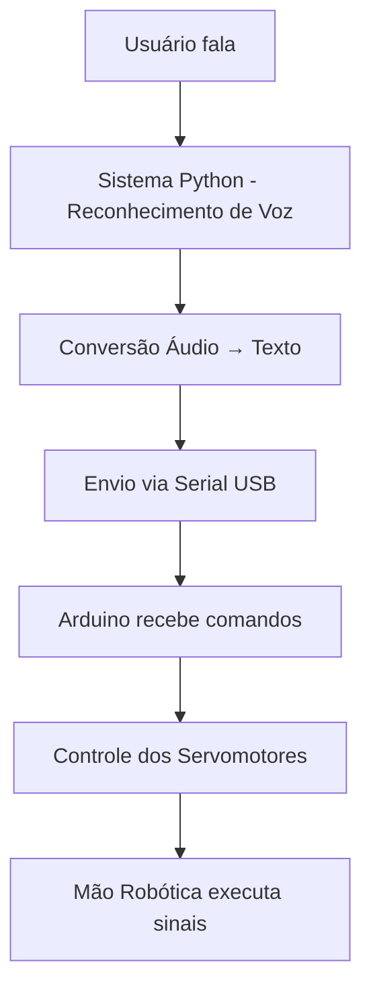

# ⚙️ Arquitetura do Sistema

## 🔁 Fluxo de Funcionamento

O sistema funciona através de um pipeline de processamento em 4 etapas principais:



### Etapa 1: Captura de Áudio
- O usuário fala uma palavra ou frase
- O microfone captura o áudio em tempo real
- O áudio é processado e preparado para análise

### Etapa 2: Processamento de Voz
- O sistema Python utiliza a biblioteca SpeechRecognition
- Envio do áudio para API do Google Speech Recognition
- Recepção e processamento do texto reconhecido

### Etapa 3: Comunicação Serial
- O texto é enviado via comunicação serial (USB) para o Arduino
- Protocolo simples: uma letra por vez seguida de `\n`
- Controle de fluxo e sincronização entre sistemas

### Etapa 4: Controle Robótico
- O Arduino interpreta cada letra recebida
- Movimenta os servomotores correspondentes
- Executa os movimentos da mão robótica para formar as letras da Libras

## 🏗️ Componentes da Arquitetura

### Camada de Interface (Python)
- **Responsabilidade**: Captura de áudio e comunicação com APIs
- **Tecnologias**: SpeechRecognition, PyAudio, PySerial
- **Entrada**: Áudio do microfone
- **Saída**: Comandos seriais para Arduino

### Camada de Controle (Arduino)
- **Responsabilidade**: Controle dos servomotores
- **Tecnologias**: Arduino IDE, Servo Library
- **Entrada**: Comandos via serial
- **Saída**: Sinais PWM para servos

### Camada Física (Hardware)
- **Responsabilidade**: Execução dos movimentos
- **Componentes**: Servomotores, mão robótica 3D
- **Entrada**: Sinais PWM
- **Saída**: Movimentos físicos da mão

## 📡 Protocolo de Comunicação

### Formato das Mensagens
```
LETRA\n
```

### Exemplo de Comunicação
```
Python → Arduino: "A\n"
Arduino: Move servos para posição da letra A

Python → Arduino: "B\n"  
Arduino: Move servos para posição da letra B
```

### Configurações de Serial
- **Baud Rate**: 9600
- **Data Bits**: 8
- **Stop Bits**: 1
- **Parity**: None
- **Flow Control**: None

## ⚡ Fluxo de Dados Detalhado

1. **Inicialização**
   - Python configura SpeechRecognition
   - Arduino inicializa servos
   - Estabelece conexão serial

2. **Processamento Contínuo**
   - Loop de captura de áudio
   - Envio para API de reconhecimento
   - Envio sequencial de letras

3. **Execução de Movimentos**
   - Recepção de comandos
   - Mapeamento letra → posição servo
   - Execução coordenada dos movimentos

4. **Sincronização**
   - Delays entre letras
   - Confirmação de execução
   - Reset para próximo comando